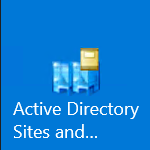
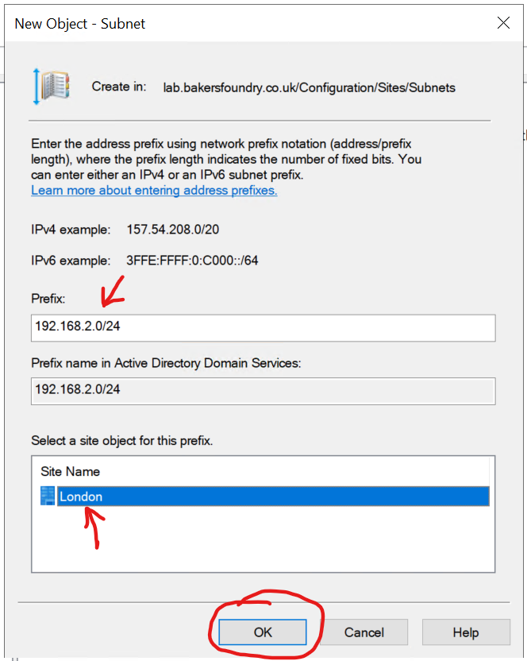
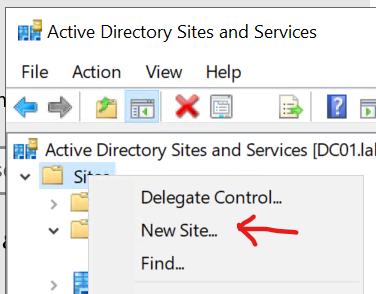
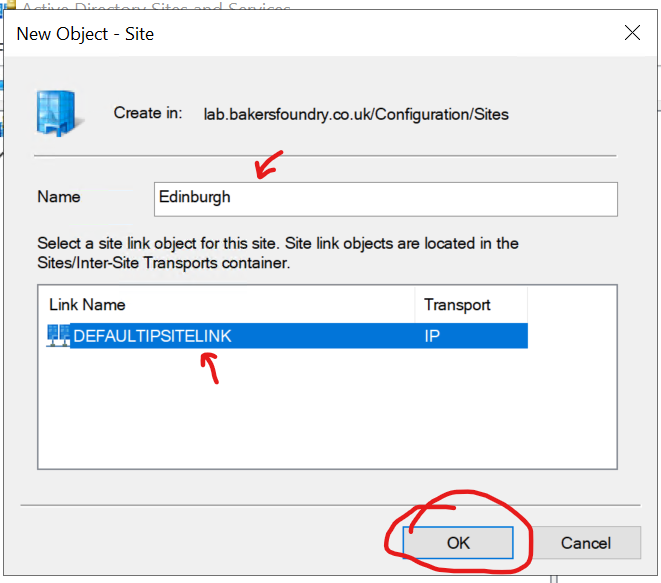
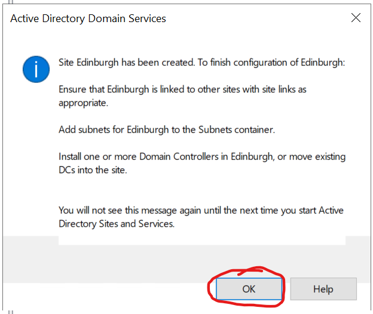
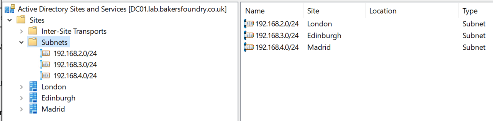

## The Challenge

I wanted to simulate a multi-site Active Directory installation I had coming up. From the inter-site WAN connections
through to the AD Sites and Services topology configuration.

As a fan of VMWare VSphere and with little experience of Hyper-V beyond conversations, I figured this was an opportunity
to familiarise myself with that technology too.

## Assumptions

Since I'd prefer to keep focused on the intended simulation, I'm avoiding going into detail on the below, so
previous knowledge and experience is assumed:

- Windows Server and networking setup.
- General Active Directory configuration.

You'll also need a host computer with sufficient resources to handle the VMs we'll create:

- 1x Windows Server 2019 Datacenter
- 2x Windows Server 2012 R2 Datacenter
- VyOS router

## How I Did It

### Gathering Resources

#### Windows Server DVD Images

I headed over to the [Microsoft Evaluation Centre](https://www.microsoft.com/en-us/evalcenter/evaluate-windows-server-2019)
to get ISOs for Server 2019 and Server 2012 R2.


#### VyOS

To simulate the inter-site routing I decided to use an old favourite - the rolling release version of
[VyOS](https://downloads.vyos.io/?dir=rolling/current/amd64).
The version I used for this lab was 1.3-rolling-202001160217.

### Setting up the Lab

#### Enabling Hyper-V

Thanks to Docker Desktop, I already had the Hyper-V role and management tools installed, but if you want to switch
it on real quick in Windows 10 Pro (assuming your system meets the relevant pre-requisites), you can use the following
PowerShell commands:

```powershell
Enable-WindowsOptionalFeature -FeatureName Microsoft-Hyper-V -Online -Verbose -All
Restart-Computer
```

#### Customising Hyper-V

Just for ease of use, I modified 2 settings in Hyper-V Manager for my lab:

Default VM and VHD locations - both set to (in my case) D:\VMs

Start Hyper-V Manager if it's not already open.


Right-click the name of your computer in Hyper-V manager, and click Hyper-V Settings...

Change the default Virtual Machines and Virtual Hard Disks folders and click OK.


#### Windows Server Base VMs

Next I set up 2 VMs, one for Windows 2019 Datacenter and one for Server 2012 R2.

I won't go into detail about the install process for Windows Server - that's outside the scope of this guide - I'll
just touch on any non-default settings conducive to my intended lab scenario.

##### Quick summary of settings:

- Location: D:\VMs\\[VM-Name]
- Virtual Machine Generation 2
- Network Connection: Default Switch (to allow downloading programs and updates)
- Virtual Hard Disk Size: 40GB
- Install an operating system from a bootable image file

##### Sidebar: Disabling Automatic Checkpoints

Normally, at least at time of writing, in Win 10 Pro 1909, all newly-created VMs have "Automatic Checkpoints"
enabled by default, and there is no way to globally disable this, so you need to make sure to remember to go to
the settings of each VM you create and disable the feature. You don't _have_ to disable it, but I prefer to choose
when I make checkpoints, so I always disable the automatic ones before starting a VM.


#### Windows Server post-install steps

I ran all updates, added a few programs I like to have installed (such as VS Code, for testing and running scripts),
then sysprepped both boxes, shutting them down in OOBE mode.

Next I found the VHDX files for the 2 base VMs, and set them to read-only, to make sure they couldn't be changed
after I started creating Differencing Disks with them as the source disks.

### Setting up the Sites

Before setting up the actual VMs, I wanted to get the virtual sites and routing configured - so here's how:

I made a plan! First I drew out my overall intention and the subnets I would use for each of the virtual sites,
naming each for consistency and ease of identification throughout the process. The first drawing was very abstract,
detail was added as the process continued.


#### Hyper-V Virtual Switches

In Hyper-V Manager, click Virtual Switches Manager... over on the shortcuts list on the right-hand-side.


There's already a "Default Switch" present - later, during VyOS configuration, that will be used as the Internet route.

Click "New virtual network switch" at the top, click to highlight "Internal", click "Create Virtual Switch", name it
after the site, leaving all other settings as default, then click "New virtual network switch" again, repeat
the process until you have all the sites set up, then click OK.


Ultimately, you should end up with a list of appropriately-named switches like this:


#### Configuring Host Ethernet Adapters - Important

This is an important step - you want to statically configure an IP on each of the networks specified above on your
host computer to make sure that the DHCP servers created later don't cause some strange routing issues, and also
to allow you to SSH into VyOS on any of its known static IP addresses.

Go to each of the appropriately-named Ethernet Adapters in Network and Sharing Center on your host PC, and give an
IP address of `.249` on each of the respective subnets, **making sure to leave Default Gateway and DNS Servers
empty.** - For example, the 'London' Ethernet Adapter would be configured like this:


#### VyOS

Next I set up VyOS to handle the inter-site routing.

##### VM Setup

Back in Hyper-V Manager, create a new VM, observing the below non-default options.

##### Quick summary of settings:

- Location: D:\VMs\\[VM-Name]
- Virtual Machine Generation 1
- Startup Memory: 512MB
- Uncheck "Use Dynamic Memory for this virtual machine" (if you don't, VyOS seems to consume all available system
memory over time)
- Network Connection: Default Switch (to allow downloading programs and updates)
- Virtual Hard Disk Size: 2GB
- Install an operating system from a bootable image file

##### Adding Network Adapters

After the New Virtual Machine wizard is finished, right-click the VyOS VM and click Settings...

Click Add Hardware, then choose Network Adapter and click Add:


From the Virtual Switch drop-down, choose the Virtual Switch you want the Network Adapter connected to.

Repeat this process until you have added a Network Adapter and connected it to each of the named sites. In this
case, London, Edinburgh and Madrid.

Click Apply. Your VyOS hardware summary should look similar to this:


Leave this Settings window for VyOS open - you'll need some information from it when you set up the ethernet
adapters inside VyOS.

##### Booting the VyOS installer

Start the VM and open its console.

Click in the window and press enter to choose "Live (amd64-vyos)" - if you don't, it will start by default anyway.

Go back to the Settings window for VyOS and click refresh at the top.


Next, expand the Network Adapters for all 4 switches (include the Default one), then highlight Advanced Features,
updating the network topology drawing with the last 2 digits of the MAC address shown - this will make it easier
to identify the ethernet adapters and name them in VyOS shortly.


Now close the VyOS Settings window.

##### Logging in and installing VyOS

Back in the VyOS console, log in with `vyos` as both the user name and the password.

Type `install image` and press `ENTER`

`Yes` you would like to continue `ENTER`

Partition `Auto` `ENTER`

Install the image on `sda` `ENTER`

Continue `yes` `ENTER`

Partition size - just press `ENTER` to accept the default.

Image name - again, accept the default by pressing `ENTER`

Accept the default configuration file with `ENTER`

Create a good password for the `vyos` administrator account and press `ENTER` - *be aware that the keyboard layout
in the VyOS console is EN-US*.

Accept the default for the GRUB boot partition with `ENTER`

Type `poweroff` and hit `ENTER`, then type `y` and hit `ENTER` to shut down VyOS.

Bring up the Settings window for VyOS again, then click the DVD Drive entry and change the Media to "None" and
click OK.

Start VyOS again and open the console.

This time you should see a longer list of boot options - choose the first one ending in "(KVM console)"

##### Configuring VyOS

Login with `vyos` and the password you specified earlier.

At the `vyos@vyos:~$` prompt, type `configure` and press `ENTER` - the prompt will change to `vyos@vyos#`

##### Network Interfaces

Type `show interfaces` and press `ENTER` - you will get a list of the ethernet interfaces and their MAC addresses.


Take this opportunity to update your network topology diagram.


Keeping that handy, you can now start configuring the ethernet interfaces.

Use the below sequence of commands to set up the interfaces with meaningful descriptions and IP addresses. After
this initial setup, you'll enable the SSH server and connect to VyOS using PuTTY (or similar) which will allow you
to copy/paste commands, saving some time.

For some ease, you can use the up-arrow cursor key to bring up previous commands and just modify the bits you need.

Also for ease, VyOS supports tab auto-completion, so you can hit `TAB` for hints if you can't remember a sub-command,
or type in a few letters and press `TAB` to save typing.

```bash
set interfaces ethernet eth0 description 'Internet'
set interfaces ethernet eth0 address dhcp
commit
save
```

NOTE: `commit` will commit any changes you've made to the current session, but if you reboot the router, they will
not be saved. `save` actually writes those changes to the config. This is useful to know if you want to test something out with an option to revert if you made a mistake.

If you type `ping 8.8.8.8` and press `ENTER` you should get replies, meaning you've connected VyOS to the internet
successfully.

Pressing `CTRL+C` will stop the pings.

Now set up the remaining interfaces as below - this will give VyOS an IP ending in .250 on each network.

```bash
set interfaces ethernet eth1 description 'London'
set interfaces ethernet eth1 address 192.168.2.250/24
set interfaces ethernet eth2 description 'Edinburgh'
set interfaces ethernet eth2 address 192.168.3.250/24
set interfaces ethernet eth3 description 'Madrid'
set interfaces ethernet eth3 address 192.168.4.250/24
commit
save
```

If you type `show interfaces` and hit `ENTER` again, you should see something like this:


##### Connect via SSH

Now you can prepare VyOS to accept incoming connections on SSH.

Type the following commands:

```bash
set service ssh port 22
commit
save
```

Bring up your Network Adapters on your local Windows machine, and pick one of the adapters named after one of the
sites you've created.

Assign it an IP address on the appropriate subnet for that site (like 192.168.2.249 for London, for example), don't
bother with Default Gateway or DNS servers.

Open up your preferred TTY program (PuTTY in my case) and connect to the .250 address of VyOS on the subnet you
configured an address for in the previous step.

You may need to click Yes to a security thumbprint dialog. Obviously we would never be so ignorant of security in
production.

Enjoy the ability to resize the console window to your heart's content(!)

Log in to VyOS with your username and password - once again note that when you configured the password for VyOS
initially, it was in an EN-US keyboard layout.

Type `configure` at the `vyos@vyos:~$` prompt and press `ENTER`

Now you can copy and paste commands in to VyOS.

##### General VyOS Settings

Next some general settings such as the router's name, time zone and domain name, and DNS servers for internet
name resolution.

I named mine rtr01 with a domain name matching the lab AD domain I would be creating.

```bash
set system domain-name lab.bakersfoundry.co.uk
set system host-name rtr01
set system name-server 8.8.8.8
set system name-server 8.8.4.4
set system time-zone Europe/London
commit
save
```

At this point, you should get a response if you type (for example) `ping www.microsoft.com` which shows that
name resolution is working from VyOS.

I used Google's DNS servers, and since I'm based in England, I chose Europe/London as my time zone.

##### Setting up Internet Access Routing with NAT

Now to give VyOS some rules for how to handle internet-bound packets from the various subnets it's connected to.

```bash
set nat source rule 10 outbound-interface eth0
set nat source rule 10 source address 192.168.2.0/24
set nat source rule 10 translation address masquerade
set nat source rule 11 outbound-interface eth0
set nat source rule 11 source address 192.168.3.0/24
set nat source rule 11 translation address masquerade
set nat source rule 12 outbound-interface eth0
set nat source rule 12 source address 192.168.4.0/24
set nat source rule 12 translation address masquerade
commit
save
```

`outbound-interface` is telling VyOS that any packets not routable to any of its 'known' networks from the `source`
networks designated here, should be routed out via eth0 (our Internet adapter).

`Masquerade` meaning that the router substitutes its own internet-facing IP address for the IP address of the
device sending the packet, along with a randomly-assigned port number so that reply packets can be sent back to
the correct originating device by the router.

The `rule x` numbers simply designate in which order VyOS will process them - there is a range from 1-9999, VyOS'
very helpful documentation suggests keeping 1:1 NAT rules at the top (rule 1 onwards) and general traffic rules
beneath those, since VyOS will obey the first match found in the order of rules.

##### Setting up DNS Services

Because the sites will start with no DNS servers, I will enable the DNS server service, configure dns forwarders,
allow DNS requests from those sites, and instruct Vyos to listen on its IP addresses in each site.

```bash
set service dns forwarding system
set service dns forwarding name-server 8.8.8.8
set service dns forwarding name-server 8.8.4.4
set service dns forwarding allow-from 192.168.2.0/24
set service dns forwarding allow-from 192.168.3.0/24
set service dns forwarding allow-from 192.168.4.0/24
set service dns forwarding listen-address 192.168.2.250
set service dns forwarding listen-address 192.168.3.250
set service dns forwarding listen-address 192.168.4.250
commit
save
```

At this point, each site has internet access, and inter-site routing will be working.

#### Setting up Active Directory Sites and Services

##### Differencing Disks

Earlier I touched on the creation of Base Images for the Servers. Assuming they're all done, updated and sysprepped
, here's how to build VMs based on Differencing Disks, using the read-only VHDX files from the Base Image VMs as
source, or "parent" disks. Which will make up the VMs (aside from the Windows 10 Enterprise "Laptop") you will set
up in the various sites.

###### Creating the Differencing Disks

- In Hyper-V Manager, click New, then Hard Disk...
- Click Next to get past the "Welcome" screen
- Choose the same disk type as the Base VMs (I used VHDX), click Next


- Choose Differencing, click Next


- In name and location of New Disk, name the disk and folder after the intended VM (for example DC01)


- In the Parent disk selection, find the VHDX file for the appropriate version of Windows you're installing - 2019
in this case, click Next then Finish


- Repeat this process for all the intended VMs

###### Creating VMs from the Differencing Disks

To do this, follow the normal procedure for creating a new Virtual Machine, but on the "Connect Virtual Hard Disk"
step, choose "Use an existing virtual hard disk" and select the appropriate disk for the VM you're building.

NOTE: Make sure the Virtual Machine Generation matches the original Base VM.


Repeat the process to fulfill the requirements for the lab...

##### Pre-requisites

- Server 2019 Datacenter Domain Controller in London site.
  - Virtual Switch: London
  - Name: DC01
  - Domain Controller
  - Forest and Domain Functional Level: Server 2012 R2
  - FQDN: lab.domain.com
  - IP: 192.168.2.1
  - Additional Services: DHCP

- Server 2012 Datacenter server in Edinburgh site.
  - Virtual Switch: Edinburgh
  - Name: RODC01
  - IP: 192.168.3.1
  - Additional Services: DHCP

- Server 2012 Datacenter server in Madrid site.
  - Virtual Switch: Madrid
  - Name: RODC02
  - IP: 192.168.4.1
  - Additional Services: DHCP

The Edinburgh and Madrid servers should have no AD services installed at this point.

##### Site Configuration

On the London Site Windows 2019 Datacenter Server, open Active Directory Sites & Services.



##### Naming the London Site

Expand the Sites node in the left pane, then right-click `Default-First-Site-Name`, click Rename and change it to
London


##### Creating a Subnet

Right-click the `Subnets` node, then click `New Subnet...`


Enter the Subnet Prefix and length for the London site (192.168.2.0/24), then click London from the list(!) of
available sites, then click Ok.



##### Creating Additional Sites

Right-click the `Sites` node in the left-hand pane, then click `New Site...`



Name the site Edinburgh, and select the `DEFAULTIPSITELINK` and click Ok. You'll change the Site Link later.



You will see a message with next steps from Active Directory Domain Services, you can just click OK to this.



Repeat the above process for Madrid.

Next use the 'Creating a Subnet' instructions above to create corresponding Subnets for Edinburgh (192.168.3.0/24) 
and Madrid (192.168.4.0/24).

Your Sites and Services window should look like the below. Subnets matching Sites as appropriate.



Active Directory has now been told that any device which joins the Domain in a given subnet is in the corresponding
physical location, so it will find the geographically closest Domain Controller to handle security operations such
as checking credentials on login.

The Site Transports you create next will tell Active Directory how it can physically replicate data to the RODCs
created in the next section.

##### Inter-Site Transports

Expand the `Inter-Site Transports` node, then click the `IP` node.

Right-click the `DEFAULTIPSITELINK` entry, click Delete, then click Yes.

Right-click in the empty space, then click `New Site Link...`

Enter the name `LondonEdinburghVPN`, then click to highlight London and Edinburgh, then click `Add`


Repeat the above to create a link called `LondonMadridVPN` containing London and Madrid.

Double-click each of the newly-created Site Links, change the Replication Interval to 15 minutes and click Ok.

Afterwards, you should see the below in the Inter-Site Transports list.


The `Cost` metric is not relevant to you in this Lab scenario - it's intended for use as a weighting tool to allow
Active Directory to favour cheaper links over more expensive ones for Replication. Since this Lab is simulating an
always-on VPN connection, there's no need to change anything.

#### Adding the Read-Only Domain Controllers

At this stage, you've created an Active Directory Site Replication Topology, so now it's time to promote those
Servers in Edinburgh and Madrid to Read-Only Domain Controllers in the respective Sites. 

NOTE: Make sure to set the Servers' Primary DNS to the IP of the DC01 in London (192.168.2.1) prior to promoting
them to RODCs.

If you use the GUI
method to promote the Servers to Domain Controllers, you should see that the Site field is automatically
populated with the correct location, as below:


NOTE: Leave all the Read-Only Domain Controller options as default for this lab.

NOTE: You'll need to Authorise the DHCP servers on the RODCs after the dcpromo operation is completed.

Afterwards, if you expand the Servers nodes in Active Directory Sites and Services under the 3 sites, you should see the
Domain Controllers listed (you may need to refresh each site by first right-clicking the site name then clicking
refresh):


##### Testing Domain Replication

###### Allowing Event Viewer connections through the Firewall - Important

To avoid some errors in the `dcdiag` process later, you'll need to enable a rule in the Firewalls of the RODCs to
allow incoming RPC connections to Event Viewer.

Open up `firewall.cpl` and go to Advanced Settings, then `Inbound Rules`.

Scroll down to find `Remote Event Log Management (RPC)` and double-click it.

Tick the box to Enable the rule, go to the Scope tab and add the IP address for DC01 in London (192.168.2.1) to the
Remote IP address list, then click OK.

Repeat this for both RODCs.

###### Manually starting a Replication

Open Active Directory Users and Computers on DC01 in London. Create an Organisational Unit called `Standard Users`.

Open Active Directory Sites and Services, click to expand the Edinburgh site, expand Servers, RODC01, then click on
`NTDS Settings` and in the right-hand pane, right-click `RODC Connection (SYSVOL)` and click `Replicate Now` and
click Ok on the following message.

Check in Active Directory Users and Computers on the Edinburgh site RODC01, making sure you are connected to the
Edinburgh Domain Controller rather than DC01 in London (which it will do by default).

You should see the OU you created.

Repeat this process for Madrid.

###### DCDiag

On DC01 in London, open an Elevated Command Prompt.

Issue the following command:

```cmd
dcdiag /e /f:".\desktop\dcdiag.txt"
```

You should find a notepad file on DC01's desktop, showing successes in everything but DFSREvent tests and possibly
some errors relating to Hard Drive Caching.

If you want a "straight answer" on whether replication is working, you can also use the below command:

```cmd
dcdiag /e /test:replications
```

If you see this:

```txt
Directory Server Diagnosis

Performing initial setup:
   Trying to find home server...
   Home Server = DC01
   * Identified AD Forest.
   Done gathering initial info.

Doing initial required tests

   Testing server: London\DC01
      Starting test: Connectivity
         ......................... DC01 passed test Connectivity

   Testing server: Edinburgh\RODC01
      Starting test: Connectivity
         ......................... RODC01 passed test Connectivity

   Testing server: Madrid\RODC02
      Starting test: Connectivity
         ......................... RODC02 passed test Connectivity

Doing primary tests

   Testing server: London\DC01
      Starting test: Replications
         ......................... DC01 passed test Replications

   Testing server: Edinburgh\RODC01
      Starting test: Replications
         ......................... RODC01 passed test Replications

   Testing server: Madrid\RODC02
      Starting test: Replications
         ......................... RODC02 passed test Replications


   Running partition tests on : DomainDnsZones

   Running partition tests on : ForestDnsZones

   Running partition tests on : Schema

   Running partition tests on : Configuration

   Running partition tests on : lab

   Running enterprise tests on : lab.bakersfoundry.co.uk
```

You can be assured that replication is running as expected.

#### The End!

You have created a lab environment, simulating a multi-site organisation with VPN links between a Domain Controller
and 2 branch office Read-Only Domain Controllers.

If you made it this far, well done! Now take a snapshot and start playing.
